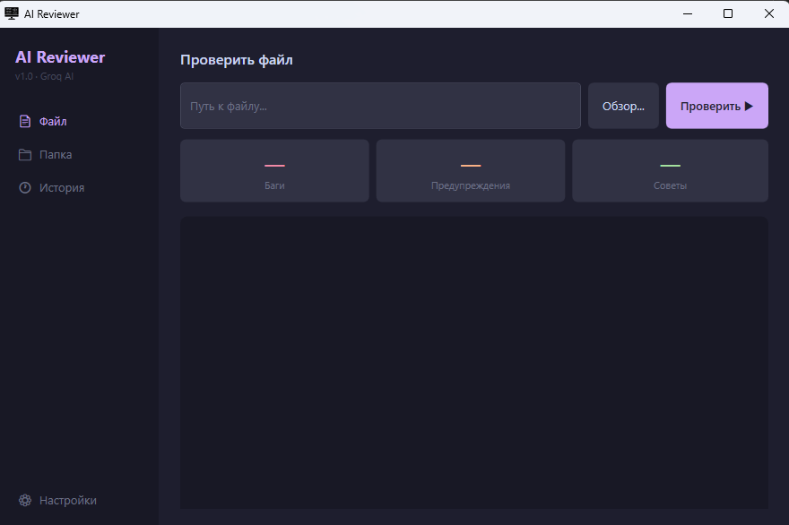

# AI Code Reviewer

Desktop-приложение для автоматического code review с помощью ИИ (Groq API + LLaMA 3.3 70B).

## Возможности

- Анализ отдельного файла или целой папки проекта
- Поддержка C#, JavaScript, TypeScript, Python, Java
- Цветной вывод: баги, предупреждения, советы
- История проверок
- Тёмная тема (Catppuccin Mocha)

## Стек

- .NET 10 / WPF
- Groq API (LLaMA 3.3 70B)
- C#

## Запуск

1. Клонируй репозиторий
2. Получи бесплатный API ключ на [console.groq.com](https://console.groq.com)
3. Открой проект в Visual Studio 2022+
4. Запусти — при первом запуске введи API ключ в разделе Настройки

## Структура проекта

| Файл | Описание |
|------|----------|
| `GroqClient.cs` | HTTP-клиент для Groq API |
| `PromptBuilder.cs` | Формирование промпта для ревью |
| `FileScanner.cs` | Сканирование папки по расширению |
| `HistoryManager.cs` | Сохранение истории проверок |
| `ConfigManager.cs` | Хранение API ключа |
| `MainWindow.xaml` | UI на WPF |